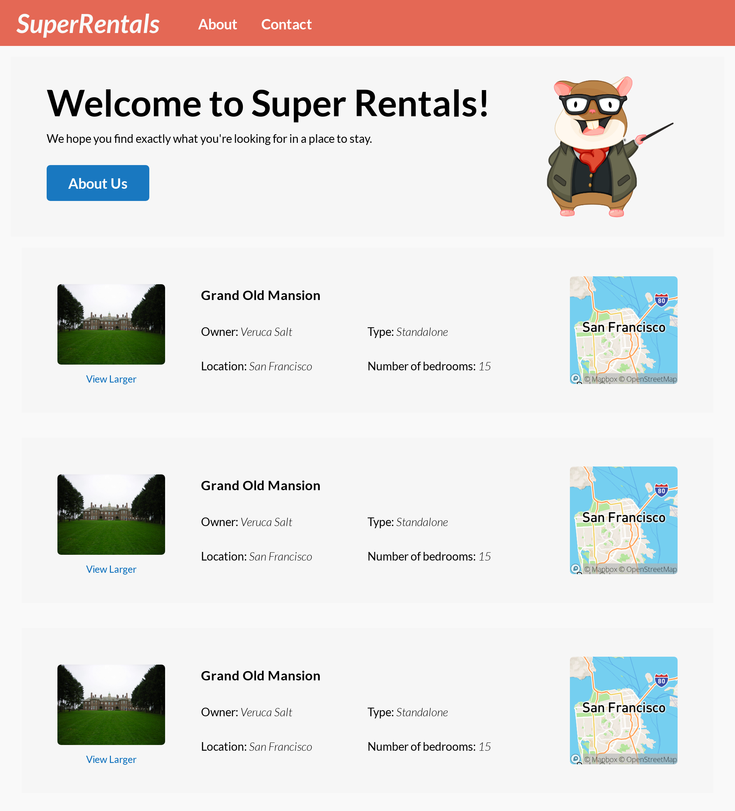
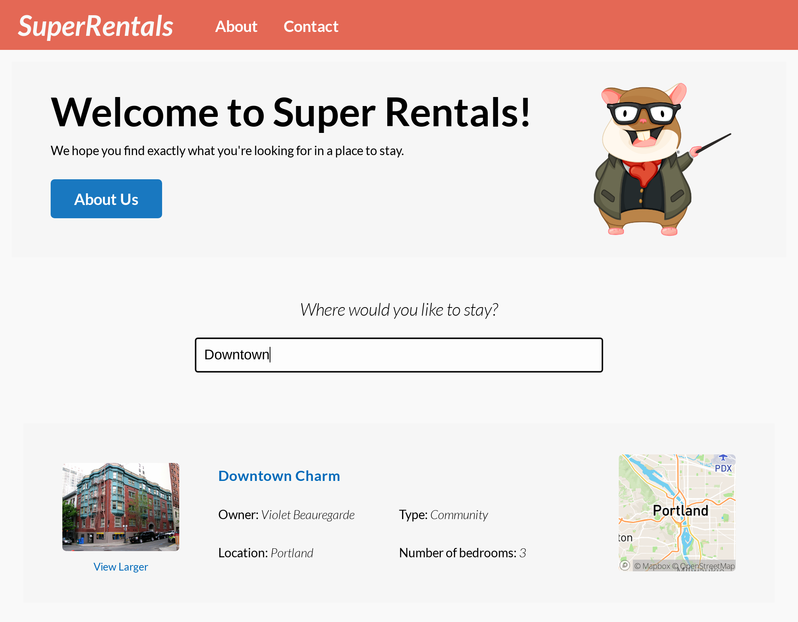
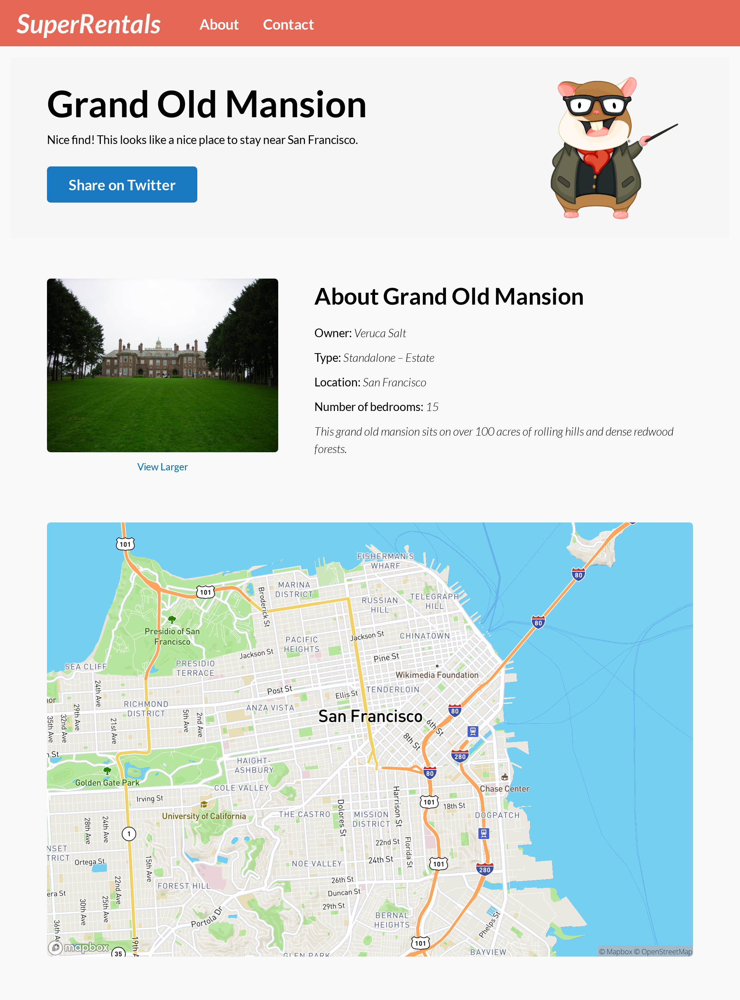

# SUPER RENTALS COM EMBERJS
👨‍🏫ESTE PROJETO É UMA APLICAÇÃO DE ALUGUEL DE IMOVEIS FICTÍCIA!

 <br> 
 <br> 
 <br> 
 <br> 

## DESCRIÇÃO:
- "Super Rentals" é um projeto de exemplo frequentemente utilizado na documentação e tutoriais do Ember.js para demonstrar os conceitos fundamentais do framework. Este projeto é uma aplicação de aluguel de imóveis fictícia, onde os usuários podem visualizar uma lista de propriedades disponíveis para aluguel e obter informações detalhadas sobre cada uma delas.

- Ele foi feito para ajudar os desenvolvedores a entenderem como criar uma aplicação web completa usando o Ember.js, abrangendo desde a configuração do projeto até a implementação de funcionalidades mais avançadas, como roteamento, componentes, serviços e integração de API externa. 

## PAGINAS/FUNCIONALIDADES:
1. **Página inicial**: Uma página inicial que exibe uma lista de propriedades disponíveis para aluguel. Os usuários podem navegar através dessas propriedades e obter uma prévia das informações básicas, como título, localização e preço.

2. **Detalhes da propriedade**: Ao clicar em uma propriedade específica, os usuários são levados a uma página de detalhes da propriedade, onde podem visualizar informações mais detalhadas, como descrição, comodidades, imagens e disponibilidade.

3. **Filtragem e ordenação**: Os usuários têm a capacidade de filtrar e ordenar a lista de propriedades com base em critérios como preço, localização e tipo de propriedade.

4. **Reservas**: A aplicação também oferece a funcionalidade de reservar uma propriedade, onde os usuários podem selecionar as datas desejadas para sua estadia e confirmar a reserva.

## EXECUTANDO O PROJETO:
1. **Instalando as Dependências:**
   - Para instalar as dependências listadas no arquivo "package.json", você pode usar o comando `npm install` no terminal. Certifique-se de estar no diretório `CODIGO/`:
   ```bash
   npm install
   ```

2. **Configurar a API Mapbox:**

   - **Crie uma conta no Mapbox**: Acesse o site do [Mapbox](https://www.mapbox.com/) e crie uma conta gratuitamente. Você não precisa de um cartão de crédito para se inscrever.

   - **Obtenha seu token de acesso**: Após criar sua conta, faça login no Mapbox e acesse o painel de controle. Lá, você encontrará seu token de acesso, que será necessário para autenticar suas solicitações à API Mapbox.

   - **Adicione seu token ao aplicativo**: Depois de se inscrever no serviço, pegue seu token público padrão e cole-o em `CODIGO/app/config/environment.js`:
   ```javascript
   'use strict';
   module.exports = function (environment) {
   const ENV = {
      modulePrefix: 'super-rentals',
      environment,
      rootURL: '/',
      locationType: 'history',
      EmberENV: {
         RAISE_ON_DEPRECATION: true,
         EXTEND_PROTOTYPES: false,
         FEATURES: {
         // Here you can enable experimental features on an ember canary build
         // e.g. EMBER_NATIVE_DECORATOR_SUPPORT: true
         },
      },

      APP: {
         // Here you can pass flags/options to your application instance
         // when it is created
      },
   };

   if (environment === 'development') {
      // ENV.APP.LOG_RESOLVER = true;
      // ENV.APP.LOG_ACTIVE_GENERATION = true;
      // ENV.APP.LOG_TRANSITIONS = true;
      // ENV.APP.LOG_TRANSITIONS_INTERNAL = true;
      // ENV.APP.LOG_VIEW_LOOKUPS = true;
   }

   if (environment === 'test') {
      // Testem prefers this...
      ENV.locationType = 'none';

      // keep test console output quieter
      ENV.APP.LOG_ACTIVE_GENERATION = false;
      ENV.APP.LOG_VIEW_LOOKUPS = false;

      ENV.APP.rootElement = '#ember-testing';
      ENV.APP.autoboot = false;
   }

   if (environment === 'production') {
      // here you can enable a production-specific feature
   }

   ENV.MAPBOX_ACCESS_TOKEN = 'paste your Mapbox access token here';

   return ENV;
   };
      ```

3. **Executando o Aplicativo:**
   - Para iniciar o servidor, você deve estar no diretório `CODIGO/` e execute o seguinte comando:
   ```bash
   ember serve
   ```

   - Acesse o aplicativo no navegador visitando `http://localhost:4200`.

4. **Interagindo com o Aplicativo:**

   - **Navegação pelas páginas**: Você pode navegar pelas diferentes páginas do aplicativo clicando nos links na barra de navegação ou nos botões disponíveis.

   - **Visualização de propriedades**: Na página inicial, você verá uma lista de propriedades disponíveis para aluguel. Cada propriedade listada terá informações básicas, como título, localização e preço. Você pode clicar em uma propriedade para ver mais detalhes sobre ela.

   - **Detalhes da propriedade**: Ao clicar em uma propriedade, você será levado para a página de detalhes dessa propriedade. Aqui você encontrará informações mais detalhadas, como descrição, comodidades, imagens e disponibilidade. Você pode explorar essas informações e até mesmo decidir fazer uma reserva, se desejar.

   - **Digite a consulta de pesquisa:** Após digitar a consulta de pesquisa,pressione Enter no teclado para iniciar a pesquisa. O aplicativo processará a consulta e retornará os resultados relevantes. Após enviar a consulta de pesquisa, você verá os resultados correspondentes exibidos na página. Pode examinar a lista de propriedades de aluguel que correspondem à sua consulta e clicar em uma propriedade para obter mais informações ou fazer uma reserva.

## NÃO SABE?
- Entendemos que para manipular arquivos em `HTML`, `CSS` e outras linguagens relacionadas, é necessário possuir conhecimento nessas áreas. Para auxiliar nesse aprendizado, oferecemos cursos gratuitos disponíveis:
* [CURSO DE HTML E CSS](https://github.com/VILHALVA/CURSO-DE-HTML-E-CSS)
* [CURSO DE EMBERJS](https://github.com/VILHALVA/CURSO-DE-EMBERJS)
* [CONFIRA MAIS CURSOS](https://github.com/VILHALVA?tab=repositories&q=+topic:CURSO)

## CREDITOS:
- [PROJETO CRIADO PELO "ember learn"](https://github.com/ember-learn/super-rentals)
- [PROJETO BASEADO NA DOCUMENTAÇÃO](https://guides.emberjs.com/v5.7.0/tutorial/part-1/)
- [PROJETO FEITO PELO VILHALVA](https://github.com/VILHALVA)


